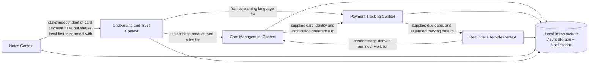

# Design Spec 2: Context Map

## Purpose

Show how the core bounded contexts relate to each other in the current v1 design.

## Relationship Notes

- Card Management is upstream for provider identity, last 4 digits, tags, and notification preference.
- Payment Tracking owns billing, due date, extended tracking, and settlement-related meaning.
- Reminder Lifecycle depends on Payment Tracking to derive stages and on Card Management for context.
- Notes remain intentionally separate from payment rules.
- Onboarding and Trust shape language, promises, and warning boundaries across the product.
